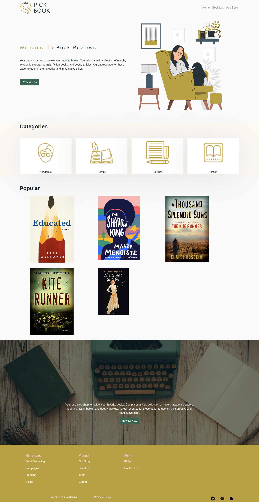

# Welcome to PhotoZone
This is a photo fetch-and-display website, 05/10/2022

By Group 1 (DevKnights)

## **Contributors**
-Stephen Munyao

-Kevin Kipkoech

-Afandi Elomda

-Jaffar Gura

-Kazungu Ang'ila

## **Table of Contents**
[Description](#description)

[Installation Requirements](#installationrequirements)

[Installation Process](#installationprocess)

[Technology Used](#technologyused)

[License](#license)

## **Description**
This website was developed using React.js (frontend) and Sinatra-ActiveRecord (backend). 

## **Key Functionalities of the WebApp**
-Selecting a book for review/deletion

-Posting a review

-Deleting a book

## **Installation Requirements**
To install and run this project, you need:

-a laptop with a pre-installed operating system.

-Internet connection

-node installed on computer
## **Installation Process**
1. Clone the project onto your computer using the git clone command. Remember to use my repository address as the source. 
2. Navigate to the project folder and run these commands:

    npm install

    json-server --watch db.json

    npm start

3. The website may fail to display contents earlier on depending on internet space and ability to access online resources such as the font-awesome library and the API. If that happens, please give it a few minutes. 
## **Technology Used**
-React.js

-Ruby

-Sinatra & ActiveRecord

-CSS

## **License**
MIT License Copyright (c) 2022 Group 1

 ## **Page Screenshot**

 